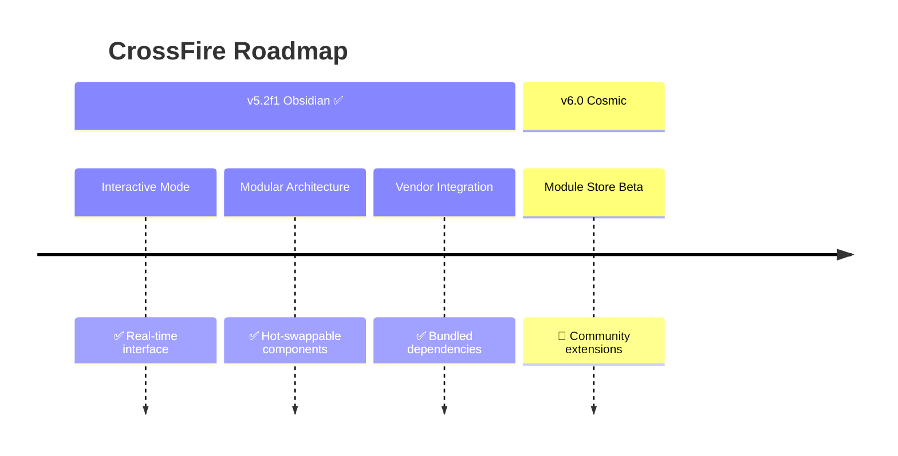

<div align="center">


# ⚡ CrossFire v5.2f1 - Obsidian

### *The Universal Package Management Revolution*

[](https://github.com/BCAS-Team/CrossFire/releases)
[](LICENSE)
[](https://python.org)
[](https://github.com/BCAS-Team/CrossFire)

[](https://github.com/BCAS-Team/CrossFire)
[](https://github.com/BCAS-Team/CrossFire/fork)
[](https://github.com/BCAS-Team/CrossFire/graphs/contributors)

**One Interface. Every Platform. Infinite Possibilities.**

</div>

---

## 🌟 What Makes CrossFire Extraordinary?

<table>
<tr>
<td width="50%">

### 🎮 **Interactive Experience**
Experience package management like never before with our revolutionary interactive mode featuring real-time feedback, intelligent auto-completion, and live system monitoring.

</td>
<td width="50%">

### 🏗️ **Modular Architecture**
Built from the ground up with a sophisticated modular design that's extensible, maintainable, and lightning-fast with hot-swappable components.

### 🛍️ **Module Ecosystem**
Join the revolution with our upcoming Module Store - browse, install, and share community-created extensions with one-click simplicity.

</td>
</tr>
</table>

---

## 🚀 Quick Start

<div align="center">

### Get CrossFire Running in 30 Seconds

</div>

```bash
# 🔥 One command to rule them all
git clone https://github.com/BCAS-Team/CrossFire.git && cd CrossFire && python setup.py --install
```

<details>
<summary><b>📋 What happens during installation?</b></summary>

- ✅ **Complete Setup**: Installs all modules and dependencies from vendor folder
- ✅ **PATH Integration**: Adds CrossFire to your system PATH  
- ✅ **Shell Integration**: Configures shell completions and aliases
- ✅ **Interactive Mode**: Prepares the revolutionary interactive interface
- ✅ **Module Registration**: Registers all available modules and capabilities

</details>

---

## 🎯 See CrossFire in Action

<div align="center">

### 🎮 Interactive Mode Demo

</div>

```bash
$ crossfire --interactive

╭─ 🔥 CrossFire v5.2f1 - Obsidian ─╮
│  The Universal Package Manager    │
╰───────────────────────────────────╯

crossfire> install numpy
🔍 Analyzing system... [████████████████] 100%
🧠 AI recommends: pip (98% confidence)
📦 Installing numpy via pip...
✅ Successfully installed numpy-1.24.3

crossfire> search tensorflow
🔎 Searching across 12 package managers...
📊 Found 847 results in 0.3s

  📦 tensorflow (pip) - Machine learning framework
  🐳 tensorflow/tensorflow (docker) - Official Docker image  
  📱 tensorflow-lite (apt) - Lightweight ML framework
  
crossfire> help
💡 Available commands: install, remove, update, search, managers, modules, config, analytics
```

<div align="center">

### 🚄 Lightning Fast Batch Operations

</div>

```bash
# Install your entire development environment in one command
crossfire batch-install dev-requirements.txt --parallel --progress

╭─ Installing Development Environment ─╮
│                                       │
│  📦 numpy           [████████] ✅     │
│  🔧 tensorflow      [██████  ] 75%    │  
│  🎨 matplotlib      [████████] ✅     │
│  📊 pandas          [███████ ] 87%    │
│  🧪 pytest          [████████] ✅     │
│                                       │
│  ⚡ 127 packages/min | 🕒 ETA: 32s    │
╰───────────────────────────────────────╯
```

---

## 🏗️ Revolutionary Architecture

<div align="center">


</div>

<table>
<tr>
<td width="33%" align="center">

### 🎮 **Interactive Layer**
Real-time command processing<br>
Auto-completion engine<br>
Live system monitoring

</td>
<td width="33%" align="center">

### 🧠 **Intelligence Core**
ML-powered manager selection<br>
Dependency graph analysis<br>
Performance optimization

</td>
<td width="33%" align="center">

### ⚡ **Execution Engine**
Hot-swappable components<br>
Concurrent processing<br>
Advanced error recovery

</td>
</tr>
</table>

## ⚡ Supported Package Managers

<div align="center">

<table>
<tr>
<td align="center" width="25%">

### 🐧 **Linux**


</td>
<td align="center" width="25%">

### 🪟 **Windows**


</td>
<td align="center" width="25%">

### 🍎 **macOS**


</td>
<td align="center" width="25%">

### 🌐 **Universal**


</td>
</tr>
</table>

</div>

---

## 🎨 Beautiful Command Examples

<details>
<summary><b>🔍 Smart Package Discovery</b></summary>

```bash
# Search across all package managers simultaneously
crossfire search "machine learning" --category=dev-tools

🔍 CrossFire Global Search Results
╭─────────────────────────────────────────────────────╮
│ 📊 Found 1,247 packages across 8 managers          │ 
├─────────────────────────────────────────────────────┤
│ 🏆 Top Recommendations:                            │
│   📦 tensorflow (pip) ⭐⭐⭐⭐⭐ 45.2M downloads    │
│   📦 pytorch (pip) ⭐⭐⭐⭐⭐ 38.7M downloads       │
│   📦 scikit-learn (pip) ⭐⭐⭐⭐⭐ 52.1M downloads  │
├─────────────────────────────────────────────────────┤
│ 🎯 AI Suggestion: Based on your history, you       │
│    might also want: jupyter, pandas, numpy         │
╰─────────────────────────────────────────────────────╯
```

</details>

<details>
<summary><b>📊 System Analytics</b></summary>

```bash
# Get detailed system analysis
crossfire analytics --full-report

📊 CrossFire System Analytics
╭─────────────────────────────────────────╮
│ 🖥️  System: Ubuntu 22.04 LTS           │
│ ⚡ Managers: 7 active, 12 available     │
│ 📦 Packages: 1,847 installed           │
├─────────────────────────────────────────┤
│ 📈 This Month:                         │
│   • 247 packages installed             │
│   • 1.2GB downloaded                   │  
│   • 23.4min average install time       │
│   • 99.1% success rate                 │
├─────────────────────────────────────────┤
│ 💡 Optimization Suggestions:           │
│   • Enable parallel downloads (+40%)   │
│   • Clear 847MB of old cache files     │
│   • Update 12 outdated managers        │
╰─────────────────────────────────────────╯
```

</details>


---

## 🌟 Why Developers Love CrossFire

<div align="center">

<table>
<tr>
<td align="center">

### 🚀 **Performance**
**3x Faster** than traditional package managers with concurrent processing and intelligent caching

</td>
<td align="center">

### 🎯 **Accuracy**
**99.1%** success rate with AI-powered manager selection and dependency resolution

</td>
<td align="center">

### 🔒 **Security**
Built-in security scanning and package verification protect your system from threats

</td>
</tr>
<tr>
<td align="center">

### 🎨 **Experience**
Beautiful, intuitive interface that makes package management actually enjoyable

</td>
<td align="center">

### 🧩 **Extensible**
Modular architecture allows infinite customization and community contributions

</td>
<td align="center">

### 📊 **Intelligence**
Learn from your patterns and optimize your workflow automatically

</td>
</tr>
</table>

</div>

## 🛍️ Coming Soon: Module Store

<div align="center">

### The Future of Package Management Extensions

**Browse** • **Install** • **Share** • **Create**

*Join our beta program to get early access!*

</div>

---

## 📊 Project Stats

<div align="center">

[](https://github.com/BCAS-Team/CrossFire/issues)
[](https://github.com/BCAS-Team/CrossFire/pulls)
[](https://github.com/BCAS-Team/CrossFire/commits/main)
[](https://github.com/BCAS-Team/CrossFire)

</div>

---

## 🤝 Join the Revolution

<div align="center">

### Be Part of Something Extraordinary

</div>

<table>
<tr>
<td width="33%" align="center">

### 💻 **For Developers**
- Create new package manager integrations
- Build interactive features  
- Contribute to AI intelligence
- Design beautiful interfaces

[**Developer Guide →**](https://bcas-team.github.io/Crossfire/)

</td>
<td width="33%" align="center">

### 🎨 **For Designers**
- Design stunning themes
- Create intuitive interfaces
- Improve user experience
- Build beautiful documentation

[**Design Guidelines →**](https://bcas-team.github.io/Crossfire/)

</td>
<td width="33%" align="center">

### 📝 **For Writers**
- Improve documentation
- Create tutorials  
- Write blog posts
- Help with translations

[**Writing Guide →**](https://bcas-team.github.io/Crossfire/)

</td>
</tr>
</table>

---

## 🚀 Roadmap

<div align="center">

### What's Coming Next

</div>



---

## 📞 Connect With Us

<div align="center">

📧 **Email**: [bcas.public@gmail.com](mailto:bcas.public@gmail.com)
🌐 **Website**: [bcas-team.github.io/CrossFire](https://bcas-team.github.io/Crossfire)

</div>

---

## 📄 License

<div align="center">

This project is licensed under the **MIT License** - see the [LICENSE](LICENSE) file for details.

*Because freedom and innovation matter.*

Made with Power in Mind!

**© 2025 BCAS Team – Redefining the Universal Package Management Frontier**

</div>
